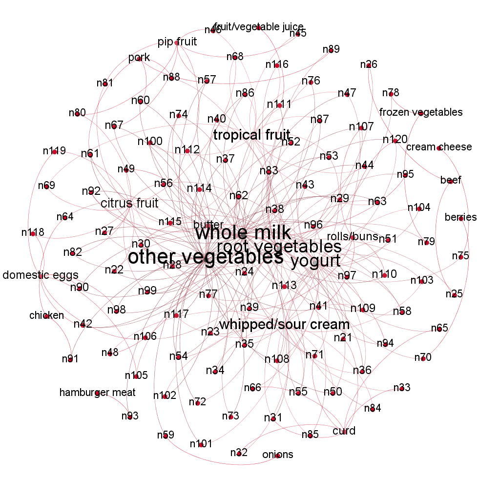

```{r setup, include=FALSE, echo=FALSE, messages = FALSE, warning = FALSE}
knitr::opts_chunk$set(echo = FALSE, tidy.opts=list(width.cutoff=40),tidy=TRUE, results = 'asis')
```

Github link : https://github.com/aric95/STA-380-Intro-to-ML-Exercises-2

# Visual story telling part 1: green buildings

### Objective : Evaluating the economic impact of going green for a new real estate project 

```{r echo=FALSE, message=FALSE, warning=FALSE, out.height= "30%"}
library(tidyverse)
library(gridExtra)
library(pivottabler) 

#reading the data 
greenbuildings = read.csv('greenbuildings.csv')
greenbuildings$green_rating <- as.factor(greenbuildings$green_rating)

#summarising the rent for green building vs. regular building 
print("We seggregated rent for green vs. regular building to review preliminary rent patterns")
summary(greenbuildings$Rent[greenbuildings$green_rating ==1])
summary(greenbuildings$Rent[greenbuildings$green_rating ==0])
```

### Step 1 : 

We will Visualize the data to identify confounding variables affecting rent and then arrive at the numbers that can be used for calculations


```{r echo=FALSE, message=FALSE, warning=FALSE, out.height= "25%", align="center"}
# Visualizations
ggplot(data=greenbuildings) + 
  geom_point(mapping=aes(x=cluster_rent, y=Rent, colour=green_rating)) +
  labs(x="Cluster Rent", y='Rent', title = 'Green buildings: Cluster rent VS Rent',
       color='Green building')

ggplot(data=greenbuildings) + 
  geom_point(mapping=aes(x=age, y=Rent, colour=green_rating))+
  labs(x="Age", y='Rent', title = 'Green buildings: Age VS Rent',
       color='Green building')

ggplot(data=greenbuildings) + 
  geom_point(mapping=aes(x=size, y=Rent, colour=green_rating)) +
  labs(x="Size", y='Rent', title = 'Green buildings: Size VS Rent',
       color='Green building')

ggplot(data=greenbuildings) + 
  geom_point(aes(x=age, y=Rent, colour=class_a))+
  labs(x="Age", y='Rent', title = 'Class A: Age VS Rent',
       color='Class A building')
```

Few preliminary findings from the correlation plots  - 

* Rent is correlated with the cluster rent
* Rent is correlated with the size, as expected
* Most of the class A buildings are also younger and have higher rent as they are premium buildings 
* Age does not have a high correlation with rent 

To further explore the rent dynamics, lets run a linear regression

```{r echo=FALSE, message=FALSE, warning=FALSE, out.height= "25%"}
#Linear Regression
#cluster rent has been excluded from regression since it might leak info to the model
lm.fit1 = lm(Rent~. - (cluster_rent), greenbuildings)
summary(lm.fit1)
```

**Insights** : 

From the linear regression, it can be concluded that rent is dependent on a lot of variables and we need to consider them before calculating the median rent for green buildings -  
  1. Rent is dependent on the size 
  2. Rent depends on the class of the building (a vs b)
  3. Rent depends on a lot of other factors which we do not know about this new project, such as gas cost, electricity cost  

**Most importantly, rent is highly dependent on the location. Post performing some desk research, we find that East and Downtown seem to have the highest rent per square feet in Austin.** 

Links for prices based on location - 
https://www.commercialcafe.com/office-market-trends/us/tx/austin/ ; 
https://www.propertyshark.com/cre/office/us/tx/austin/east-cesar-chavez/ ; 
https://aquilacommercial.com/learning-center/cost-to-lease-office-space-austin-tx/ ; 

Additionally, since our building is supposed to be 250,000 Square feet, we should also filter for buildings with similar size - in the range of 200,000 - 300,000 Square Feet

(we will also exclude buildings with occupancy less than 10% to avoid distortion in our analysis)

```{r echo=FALSE, message=FALSE, warning=FALSE, out.height= "25%"}
#filtering data for all the buildings with above specifications 
minimum_rent = quantile(greenbuildings$Rent, .25) 

data_filtered = greenbuildings %>% filter(size >= 200000 , size <= 300000, Rent > minimum_rent, leasing_rate >= 10)

data_filtered$green_bld_identifier = ifelse(data_filtered$green_rating == 1, "Green building","Regular Building")

#filtering data for regular buildings with above specifications 
data_filtered_non_green = greenbuildings %>% filter(size >= 200000 , size <= 300000, green_rating == 0)

#filtering data for green buildings with above specifications  
data_filtered_green = greenbuildings %>% filter(size >= 200000 , size <= 300000, stories >= 13, stories <= 17, green_rating == 1)

#calculating mean, median rent for filtered green vs. regular buildings
qhpvt(data_filtered, "green_bld_identifier", , 
     c("Mean Rent"="mean(Rent, na.rm=TRUE)", "Median Rent"="median(Rent, na.rm=TRUE)"), 
     formats=list("%.0f", "%.1f"))
```

Insights : 

Rent per Square feet for regular building seems to be more than Green building, contrary to what excel guru calculated.  Hence, excel guru had the median rates wrong since he directly calculated the median from the entire data. 

```{r echo=FALSE, message=FALSE, warning=FALSE, out.height= "25%"}
data_filtered %>% group_by(green_bld_identifier) %>% summarise(n = n()) 
```

Caveat : After filtering the data based on the above specificaitons, we are left with very few data points (10% of the total points) which might not yield correct results. Ideally, we would require a lot more data points to go ahead with this approach and correctly estimate median rents for green vs. regular buildings. 

Hence, we will proceed ahead with the entire data set for further analysis. 

```{r echo=FALSE, message=FALSE, warning=FALSE, out.height= "25%"}
g = ggplot(greenbuildings, aes(x=age))

g + geom_density(aes(fill=factor(green_rating)), alpha=0.4)+
  labs(x="Age", y='Density', title = 'Distribution of age',
       fill='Green building')

ggplot(greenbuildings, aes(class_a, ..count..)) + geom_bar(aes(fill = green_rating), position = "dodge")+
  labs(x="Class a", y='Number of buildings', title = 'Class A vs Green Buildings',
       fill='Green building')

g = ggplot(greenbuildings, aes(x=size))
g + geom_density(aes(fill=factor(green_rating)), alpha=0.4)+
  labs(x="Size", y='Density', title = 'Distribution of size',
       fill='Green building')

medians <- aggregate(Rent ~  class_a, greenbuildings, median)
ggplot(data=greenbuildings, aes(x=factor(class_a), y=Rent, fill=class_a)) + geom_boxplot()+
  stat_summary(fun.y=median, colour="darkred", geom="point", 
               shape=18, size=3,show.legend = FALSE) + 
  geom_text(data = medians, aes(label = Rent, y = Rent - 20)) +
  labs(x="Class A", y='Rent', title = 'Rent vs Class a',
       fill='Class A')

```

Insights : 

* Most of the green buildings are younger than non-green buildings 
* The proportion of class a buildings is higher in green buildings 
* The proportion of green and non-green building increases as the size of buildings increases
* The is a significant difference in the of rent of class a and non-class a buildings 

Next, we identified patterns between median rent for all buildings with age and size, and class a and non class a median rent with age and size.

```{r echo=FALSE, message=FALSE, warning=FALSE, out.height= "25%"}
greenbuildings$age_cat <- cut(greenbuildings$age, breaks = c(0, seq(10, 190, by = 10)), labels = 0:18,right=FALSE)
medians <- aggregate(Rent~ age_cat + green_rating, greenbuildings, median)
ggplot(data = medians, mapping = aes(y = Rent, x = age_cat ,group = green_rating, colour=green_rating)) +
   geom_line(size=1.2) +
  labs(x="Age in 10 years", y='Median Rent', title = 'All buildings: Median rent over the years',
       fill='Green building')

# Size of the buildings are in 100k
greenbuildings$size_cat <- cut(greenbuildings$size, breaks = c(0, seq(10, 3781045, by = 100000)), labels = 0:37,right=FALSE)
medians <- aggregate(Rent ~ size_cat + green_rating, greenbuildings, median)
ggplot(data = medians, mapping = aes(y = Rent, x = size_cat ,group = green_rating, colour=green_rating)) +
   geom_line(size=1.2) +
  labs(x="Size in 100k sq.ft", y='Median Rent', title = 'All buildings: median rent for different building sizes',
       fill='Green building')
data_non_class_a <- subset(greenbuildings, greenbuildings$class_a != 1)
data_non_class_a$age_cat <- cut(data_non_class_a$age, breaks = c(0, seq(10, 190, by = 10)), labels = 0:18,right=FALSE)
medians <- aggregate(Rent~ age_cat + green_rating, data_non_class_a, median)
ggplot(data = medians, mapping = aes(y = Rent, x = age_cat ,group = green_rating, colour=green_rating)) +
   geom_line(size=1.2)+
  labs(x="Age in 10 years", y='Median Rent', title = 'Non-Class A buildings: Median rent over the years',
       fill='Green building')

# Size of the buildings are in 100k
data_non_class_a$size_cat <- cut(data_non_class_a$size, breaks = c(0, seq(10, 3781045, by = 100000)), labels = 0:37,right=FALSE)
medians <- aggregate(Rent ~ size_cat + green_rating, data_non_class_a, median)
ggplot(data = medians, mapping = aes(y = Rent, x = size_cat ,group = green_rating, colour=green_rating)) +
   geom_line(size=1.2)+
  labs(x="Size in 100k sq.ft", y='Median Rent', title = 'Non-class A buildings: median rent for different building sizes',
       fill='Green building')
```
Insights :

* For all buildings, the median rent over the years is higher than non green buildings for age between 2 to 9 years
* The rent of green buildings is lower than non-green ones when they are not class a buildings
* The rent difference is not uniform across different sizes and ages 

Next, we calculated median leasing rate for class a buildings of sizes ranging from 200k to 300k sq.ft, difference in rent for the first 5 years for class a and non class a buildings.

```{r echo=FALSE, message=FALSE, warning=FALSE, out.height= "25%"}
data_size <- subset(greenbuildings, greenbuildings$size > 200000 & greenbuildings$size < 300000)
data_size <- subset(data_size, data_size$class_a == 1)
data_size_class <- subset(greenbuildings, data_non_class_a$size > 200000 & data_non_class_a$size < 300000)
paste("Median leasing rate for class a buildings of sizes ranging from 200k to 300k sq.ft ", 
median(data_size$leasing_rate))
medians <- aggregate(Rent~ age_cat + green_rating, data_size, median)
medians_1 <- subset(medians, medians$green_rating == 1)
rent_1<-medians_1[1:5,]$Rent
medians_0 <- subset(medians, medians$green_rating == 0)
rent_0<-medians_0[1:5,]$Rent
paste("Difference in rent for the first 5 years class a buildings: ", 
(sum(rent_1,na.rm = T) - sum(rent_0, na.rm = T)) / 5)
medians <- aggregate(Rent~ age_cat + green_rating, data_size_class, median)
medians_1 <- subset(medians, medians$green_rating == 1)
rent_1<-medians_1[1:5,]$Rent
medians_0 <- subset(medians, medians$green_rating == 0)
rent_0<-medians_0[1:5,]$Rent
paste("Difference in rent for the first 5 years for non-class a buildings: ", 
(sum(rent_1,na.rm = T) - sum(rent_0, na.rm = T)) / 5 )
```

Insights : 

We have seen that the analysis by stats guru is flawed since he fails to account for all the factors that affect the rent. He used the median rent of all buildings to calculate the returns where he fails to account for other factors such as size and class of the buildings into his analysis. For instance, we have seen that class a green buildings have a higher rent than non green class a buildings. 

The rent difference is not uniform across different sizes and age, so we cannot use a fixed difference in rent to calculate the returns. We should also use the median leasing rate of such buildings instead of 90% rate.


- The builder should invest in a Class-A green building to yield positive returns
- We can expect a occupancy rate of 91.6% on such buildings 
- The average difference in rent for green and non-green buildings that are class a and whose sizes ranging from 200k to 300k is 3.097

From the above analysis we conclude that the benefits of going for green buildings do not outweigh non-green buildings. Moreover, the constricted dataset on the basis of regression results also imply we should not go ahead with green-buildings. Additionally, due to absence of location data, we are not sure of the range of prices we will be able to charge. Overall, we would recommend to not go ahead with developing the green building due to uncertain factors involved.

**---------------------------------------------------End of Problem---------------------------------------------------**

\newpage

# Visual story telling part 2: flights at ABIA

### Objective : Using the data, tell an interesting story about flights into and out of Austin

```{r data_initialize_abia, echo=FALSE, message=FALSE, warning=FALSE, out.height= "30%"}

#loading required libraries
library(tidyverse)
library(cowplot)

#Setting themes
theme_set(theme_bw())

#loading the data 
df_abia = read.csv("ABIA.csv")
attach(df_abia)

#manipulating and processing the data
df_abia$Date<-as.Date(with(df_abia,paste(Year,Month,DayofMonth,sep="-")),"%Y-%m-%d")
df_abia$AustinRelation = ifelse(df_abia$Origin == "AUS", "Departure", "Arrival")
df_abia$FlightStatus = ifelse(df_abia$Cancelled == 1, "Cancelled", 
                              ifelse(df_abia$ArrDelay == 0, "On Time",
                                     ifelse(df_abia$ArrDelay > 0, "Delayed", "Early")))
df_abia$ArrivalDelayFlag = ifelse(df_abia$ArrDelay > 0, 1, 0)
df_abia$DepartureDelayFlag = ifelse(df_abia$DepDelay > 0, 1, 0)
df_abia$ArrivalEarlyOnTimeFlag = ifelse(df_abia$ArrDelay <= 0, 1, 0)
df_abia$DepartureEarlyOnTimeFlag = ifelse(df_abia$DepDelay <= 0, 1, 0)

```

To start analyzing the data, lets get an idea about the monthly number of flight incoming/outbound from Austin

```{r monthly_flights, echo=FALSE, message=FALSE, warning=FALSE, out.height= "40%"}

ggplot(df_abia, aes(x = format(Date, "%m"))) + geom_bar() +
  labs(title="# Flights by Month", 
  subtitle = "Number of Flights per Month, stacked by whether they Departed or Arrived at Austin",
  x = "Month Number", 
  y = "Number of Flights") +
  theme(axis.text.x = element_text(angle=65, vjust=0.6)) +
  geom_text(stat='count', aes(label=..count..), vjust=2) + facet_wrap(~AustinRelation)

```

We see that the first 8 months of the year had the most flights operating to and from Austin. The last 4 months had lesser flights departing and arriving in Austin. **Interestingly, number of flights arriving and departing from Austin are pretty similar every month.**

Lets further break this chart down by the flight status (delayed/early/cancelled...)

```{r break_by_flight_status, echo=FALSE, message=FALSE, out.height= "40%", warning=FALSE}

ggplot(df_abia, aes(x = format(Date, "%m"))) + geom_bar(aes(fill=FlightStatus)) +
  labs(title="Flights by Month", 
       subtitle = "Number of Flights per Month, stacked by their Status",
       x = "Month Number", 
       y = "Number of Flights") +
  theme(axis.text.x = element_text(angle=65, vjust=0.6)) +
  geom_text(stat='count', aes(label=..count..), vjust=2) + facet_wrap(~AustinRelation)

```

We see a very similar trend of flight status among flights arriving and departing from Austin. Hence, nothing much can be inferred.

```{r day_of_week_flights, echo=FALSE, message=FALSE, out.height= "40%", warning=FALSE}

ggplot(df_abia, aes(x = DayOfWeek)) + geom_bar(aes(fill=FlightStatus)) +
  labs(title="Flights by Day of Week", 
       subtitle = "Number of Flights by Day of Week, stacked by their Status",
       x = "Day of Week", 
       y = "Number of Flights") +
  theme(axis.text.x = element_text(angle=65, vjust=0.6)) +
  geom_text(stat='count', aes(label=..count..), vjust=2) + facet_wrap(~AustinRelation)

```

Ratio of cancelled/delayed/early... flights seem to be similar from what we observed in monthly trends. But we do see significantly low volume of flights on Saturday. 

Next, lets analyze number of operations for each flight carrier in Austin. 

```{r flights_by_carrier, echo=FALSE, message=FALSE, out.height= "40%", warning=FALSE} 

#plotting number of operations vs. flight carrier 
ggplot(df_abia) + geom_bar(aes(x = UniqueCarrier)) + labs(x = "Unique Carrier",
                                                          y = "# Flights",
                                                          title = "Number of flights by Carrier")

```

Southwest (WN) seems to have the most number of flights operating at Austin airport. Lets see if this trend changes month over month. 

```{r flights_by_carrier_across_months, echo=FALSE, out.height= "40%", message=FALSE, warning=FALSE}

#plotting number of operations vs. flight carrier by month 
ggplot(df_abia) + geom_bar(aes(x = UniqueCarrier)) + labs(x = "Unique Carrier",
                                                          y = "# Flights",
                                                          title = "Number of flights by Carrier",
                                                          subtitle = "Distribution across months",) + facet_wrap(~Month) +                                                                 theme(axis.text.x = element_text(angle = 90))

```

We can see that the overall trend does not change month over month. However, we have one peculiar observation. **MQ flight carrier has reduced operations in July and no operations after that. Also, NW carrier (which has least operations overall) operated in just January, April and May.** 
  
  **Now, lets look at the flight delay dynamics to identify reliable vs. non reliable flights to travel!**
  
  We will filter for flights originating from Austin, and calculate % flights getting delayed for each carrier. 
Also, we will exclude the negative delay values which probably indicates flight departed before time


```{r departed_delays, echo=FALSE, message=FALSE, warning=FALSE, out.height= "40%"}
#creating a dummy column to aggregate 
df_abia$counter = 1

#filtering df_abia for flights originating from Austin
austin_origin = df_abia %>% filter(Origin == 'AUS')

#grouping the df_abia for flights originating from Austin by carriers and calculating number of times each carrier got delayed 
austin_origin_count = austin_origin %>% group_by(austin_origin$UniqueCarrier) %>% summarize(delay_count  = sum(counter)) %>% ungroup()
names(austin_origin_count)[1] <- "Unique_carrier"
names(austin_origin_count)[2] <- "Flight_count"

#creating subset of df_abia for flights which originated from austin and got delyed
austin_origin_delay = df_abia %>% filter(Origin == 'AUS', DepDelay > 0)

#grouping the df_abia for flights originating from Austin by carriers and calculating number of times each carrier got delayed 
austin_origin_delay_count = austin_origin_delay %>% group_by(austin_origin_delay$UniqueCarrier) %>% summarize(delay_count  = sum(counter)) %>% ungroup()
names(austin_origin_delay_count)[1] <- "Unique_carrier"
names(austin_origin_delay_count)[2] <- "Delay_count"

#calculating % of delayed flights for each carrier 
carrier_delay_per = merge(austin_origin_delay_count, austin_origin_count, by = "Unique_carrier" )
carrier_delay_per$percent_delay = carrier_delay_per$Delay_count / carrier_delay_per$Flight_count

#plotting the %delay for each carrier 
ggplot(carrier_delay_per) + geom_col(aes(x= Unique_carrier, y = percent_delay)) + labs(x = "Unique Carrier",
                                                                                       y = "% Delayed flights",
                                                                                       title = "% Departure - Delayed Flights per Carrier",
                                                                                       subtitle = "% Departed Flights delayed for each carrier")

```

WN, which had maximum number of flights operating at Austin airport, also had the maximum % of delayed departed flights, followed by EV, DL and XE.
US and 9E had the least % of delayed departed flights making them pretty reliable. 

We are not looking at the arrival delays, since at the end of the day, a passenger only cares if his/her flight departed on time or how late did the flight depart

Lets see if we can find any pattern in the flight delays (for carriers with highest proportion of delayed flights - WN, EV, DL, XE) based on month, day, hour, etc. across different carriers. 

```{r delay_proportions, echo=FALSE, message=FALSE, warning=FALSE, out.height= "40%"}

#filtering data for carriers with highest proportion of their flights getting delayed
austin_origin_delay_filtered = austin_origin_delay %>% filter(austin_origin_delay$UniqueCarrier %in% c('WN','EV','DL','XE')) 

#calculating average delay for these carriers month over month 
austin_origin_delay_avg = austin_origin_delay_filtered %>%group_by(Month) %>% summarise(avg_delay = mean(DepDelay)) %>% ungroup()

#changing the column name 
names(austin_origin_delay_avg)[1] <- "Month"

#converting month column to factors 
austin_origin_delay_avg$Month = as.factor(austin_origin_delay_avg$Month)

#plotting the trend
plot_1 = ggplot(austin_origin_delay_avg) + geom_col(aes(x = Month, y = avg_delay, group = 1)) + labs(x = "Month",
                                                                                                     y = "Avg. Delay Duration (in min.)",
                                                                                                     title = "Avg. Delay duration per month",
                                                                                                     subtitle = "Average Flight Delay duration for WN, EV, DL, XE across months")

#filtering data for carriers with highest proportion of their flights getting delayed
austin_origin_delay_filtered = austin_origin_delay %>% filter(austin_origin_delay$UniqueCarrier %in% c('WN','EV','DL','XE')) 

#calculating average delay for these carriers month over week
austin_origin_delay_avg_day = austin_origin_delay_filtered %>% group_by(DayOfWeek) %>% summarize(avg_delay = mean(DepDelay))

#converting week column to factors 
austin_origin_delay_avg_day$DayOfWeek = as.factor(austin_origin_delay_avg_day$DayOfWeek)

#plotting the trend
plot_2 = ggplot(austin_origin_delay_avg_day) + geom_col(aes(x = DayOfWeek, y = avg_delay, group = 1)) + labs(x = "Day of Week",
                                                                                                             y = "Avg. Delay duration (in min.)",
                                                                                                             title = "Avg. Delay Duration per Week",
                                                                                                             subtitle = "Average Flight Delay duration for WN, EV, DL, XE across days")

plot_grid(plot_1, plot_2, labels = c('', ''), ncol = 1)

```

Average delay duration seem to be 25 min or more in February, March and December 2008. This is potentially due to lot of people travelling around Spring break and Christmas holidays which causes air traffic and delays. However, average delay duration across the week seems to be pretty consistent without much variation, hence it does not provide us much insight. 

Lets see if the delay duration trend vary across each carrier.


```{r mean_delays_by_month_carrier, echo=FALSE, message=FALSE, warning=FALSE, out.height= "40%"}

#Grouping by month and carrier, calculating mean delay 
austin_origin_delay_filtered_month = austin_origin_delay_filtered %>% group_by(Month, UniqueCarrier) %>% summarize(avg_delay = mean(DepDelay))

austin_origin_delay_filtered_month$Month = as.factor(austin_origin_delay_filtered_month$Month)
ggplot(austin_origin_delay_filtered_month) + geom_point(aes(x = Month, y = avg_delay, group = 1, color = UniqueCarrier)) + labs(x = "Month",
                                                                                                                          y = "Avg. Delay duration (in min.)",
                                                                                                                          title = "Avg. Delay Duration per Carrier per Month",
                                                                                                                          subtitle = "Average monthly delay duration for DL, EV, WN, XE")

```

This gives us pretty interesting insights. EV seems to be pretty unreliable carrier due to their frequent large duration delays (> 1 hour).
WN which had maximum operations, had pretty consistent delay of >30 mins, throughout the year.

Lets us delve a little further into weekly delays, since we could not extract much insight earlier (due to consistent delay duration throughout the week). We will now look at the weekly delay duration for carriers with maximum proportion of their flights delayed (DL, EV, WN, XE) across months. 
```{r data_by_week, echo=FALSE, message=FALSE, warning=FALSE, out.height= "40%"}

#grouping by the filtered data by month and week day, calculating average delay duration
austin_origin_delay_avg_day_week = austin_origin_delay_filtered %>% group_by(Month, DayOfWeek) %>% summarize(avg_delay = mean(DepDelay))

#converting month and week column to factors
austin_origin_delay_avg_day_week$DayOfWeek = as.factor(austin_origin_delay_avg_day_week$DayOfWeek)
austin_origin_delay_avg_day_week$Month = as.factor(austin_origin_delay_avg_day_week$Month)

#plotting the trend
ggplot(austin_origin_delay_avg_day_week) + geom_col(aes(x = DayOfWeek, y = avg_delay, group = 1)) + facet_wrap(~Month) + labs(x = "Day of Week",
                                                                                                                               y = "Avg. Delay duration (in min.)",
                                                                                                                               title = "Avg. Delay Duration per Carrier per Week",
                                                                                                                               subtitle = "Weekly average flight delay duration across months")

```

On a quick glance, March, April & December seem to have higher delays on Friday when compared to other months. March has higher delay for Tuesday as well. 

Lastly, lets look at the hourly delay duration at the airport. This will help us determine the best time to travel via Austin airport.

```{r delay_by_hours, echo=FALSE, message=FALSE, warning=FALSE, out.height= "40%"}

#calculating average departure delay duration by hours of the day 
austin_origin_delay_avg_hour = austin_origin_delay %>% group_by(round(CRSDepTime/100,0)) %>% summarize(avg_delay = mean(DepDelay))

#renaming the columns 
names(austin_origin_delay_avg_hour)[1] = 'Hour_of_the_day'
austin_origin_delay_avg_hour$Hour_of_the_day = as.factor(austin_origin_delay_avg_hour$Hour_of_the_day)

#plotting the trend
ggplot(austin_origin_delay_avg_hour) + geom_line(aes(x = Hour_of_the_day, y = avg_delay, group = 1)) + labs(x = "Hours",
                                                                                                            y = "Avg. Delay duration (in min.)",
                                                                                                            title = "Avg. Delay Duration per day of the week",
                                                                                                            subtitle = "Average Delay Duration for Departed Flights")

```

Delay seems to be the maximum at 1AM and 10 PM, and the least at 6 AM. Hence, early morning, mid afternoon (around 2) or late nights are good time to travel. 

Lets look if this trend holds true for all days of the week or not.

```{r avg_delay, echo=FALSE, message=FALSE, warning=FALSE, out.height= "40%"}

#calculating average departure delay duration by hours of the day every day of the week 
austin_origin_delay_avg_day_hour = austin_origin_delay %>% group_by(DayOfWeek, round(CRSDepTime/100,0)) %>% summarize(avg_delay = mean(DepDelay))

#renaming the columns and converting hours & days of the week to factors 
names(austin_origin_delay_avg_day_hour)[2] = 'Hour_of_the_day'
austin_origin_delay_avg_day_hour$Hour_of_the_day = as.factor(austin_origin_delay_avg_day_hour$Hour_of_the_day)
austin_origin_delay_avg_day_hour$DayOfWeek = as.factor(austin_origin_delay_avg_day_hour$DayOfWeek)

#plotting the trend 
ggplot(austin_origin_delay_avg_day_hour) + geom_line(aes(x = Hour_of_the_day, y = avg_delay, group = 1))  + labs(x = "Hours",
                                                                                                                 y = "Avg. Delay duration (in min.)",
                                                                                                                 title = "Avg. Delay Duration per Carrier per Week",
                                                                                                                 subtitle = "Weekly average flight delay duration across months")+ facet_wrap(~DayOfWeek) + theme(axis.text.x = element_text(angle = 90))

```

We can see that across all days of the week, early morning, mid afternoons and late nights are good time to travel.

Now that we have analyzed Delays, lets see some summaries around arrivals and departures from Austin. 

**Flights arriving in Austin**
  
```{r top_origin, echo=FALSE, message=FALSE, warning=FALSE, out.height= "40%"}
#List of Flights arriving late to Austin
df_arrival = subset(df_abia, Cancelled == 0 & Dest == "AUS")

#Grouped table for Flight counts by Origin and Month
dep_origin <- data.frame(table(df_arrival$Origin))
colnames(dep_origin) <- c("origin", "flights") # change column names
dep_origin <- dep_origin[order(dep_origin$flights, decreasing = TRUE), ]  # sort
dep_origin$origin <- factor(dep_origin$origin, levels = dep_origin$origin)  # to retain the order in plot.
dep_origin <- head(dep_origin, 10)

ggplot(dep_origin, aes(x=origin, y=flights)) + 
  geom_bar(stat="identity", width=.5, fill="tomato3") +
  labs(title = "Top 10 Airports for Arrivals to Austin", 
       subtitle = "The top 10 Airports from which most flights arrive at Austin",
       x = "Origin Airport Code",
       y = "Number of Flights in 2008") + 
  theme(axis.text.x = element_text(angle=65, vjust=0.6)) +
  geom_text(aes(label=flights), color = "light blue", vjust=2)


```

```{r top_origin_2, echo=FALSE, message=FALSE, warning=FALSE, out.height= "40%"}

#List of Flights arriving late to Austin
df_arrival_delays = subset(df_abia, Cancelled == 0 & ArrivalDelayFlag == 1 & Dest == "AUS")

#Grouped table for Flight counts by Origin and Month
dep_delays_origin <- aggregate(df_arrival_delays$ArrivalDelayFlag, by=list(df_arrival_delays$Origin), FUN=sum)
colnames(dep_delays_origin) <- c("origin", "flights") # change column names
dep_delays_origin <- dep_delays_origin[order(dep_delays_origin$flights, decreasing = TRUE), ]  # sort
dep_delays_origin$origin <- factor(dep_delays_origin$origin, levels = dep_delays_origin$origin)  # to retain the order in plot.
dep_delays_origin <- head(dep_delays_origin, 10)

ggplot(dep_delays_origin, aes(x=origin, y=flights)) + 
  geom_bar(stat="identity", width=.5, fill="tomato3") + 
  labs(title = "Top 10 Airports for Late Arrivals to Austin", 
       subtitle = "The top 10 Airports from which flights arrive late to Austin",
       x = "Origin Airport Code",
       y = "Number of Flights in 2008") + 
  theme(axis.text.x = element_text(angle=65, vjust=0.6)) +
  geom_text(aes(label=flights), color = "light blue", vjust=2)
```

```{r top_origin_3, echo=FALSE, message=FALSE, warning=FALSE, out.height= "40%"}
#List of Flights arriving early to Austin
df_arrival_early = subset(df_abia, Cancelled == 0 & ArrivalEarlyOnTimeFlag == 1 & Dest == "AUS")

#Grouped table for Flight counts by Origin and Month
dep_early_origin <- aggregate(df_arrival_early$ArrivalEarlyOnTimeFlag, by=list(df_arrival_early$Origin), FUN=sum)
colnames(dep_early_origin) <- c("origin", "flights") # change column names
dep_early_origin <- dep_early_origin[order(dep_early_origin$flights, decreasing = TRUE), ]  # sort
dep_early_origin$origin <- factor(dep_early_origin$origin, levels = dep_early_origin$origin)  # to retain the order in plot.
dep_early_origin <- head(dep_early_origin, 10)

ggplot(dep_early_origin, aes(x=origin, y=flights)) + 
  geom_bar(stat="identity", width=.5, fill="tomato3") + 
  labs(title = "Top 10 Airports for Early / On-Time Arrivals to Austin", 
       subtitle = "The top 10 Airports from which flights arrive early or on time to Austin",
       x = "Origin Airport Code",
       y = "Number of Flights in 2008") + 
  theme(axis.text.x = element_text(angle=65, vjust=0.6)) +
  geom_text(aes(label=flights), color = "light blue", vjust=2)

```

```{r avg_arrival_delay, echo=FALSE, message=FALSE, out.height= "40%", warning=FALSE}

austin_dest_delay = df_abia %>% filter(Dest == 'AUS', ArrDelay > 0)

#calculating average departure delay duration for flights departing from Austin by top 10 destination 
austin_dest_delay_avg_dest = austin_dest_delay %>% filter(Origin %in% dep_origin$origin) %>% group_by(Origin) %>% summarize(avg_delay = mean(ArrDelay))

#renaming the columns 
names(austin_dest_delay_avg_dest)[1] = 'Origin_Airport'

#resorting the destination airpots in decreasing order of average delay duration 
austin_dest_delay_avg_dest <- austin_dest_delay_avg_dest[order(austin_dest_delay_avg_dest$avg_delay, decreasing = TRUE), ]  # sort
austin_dest_delay_avg_dest$Origin_Airport <- factor(austin_dest_delay_avg_dest$Origin_Airport, levels = austin_dest_delay_avg_dest$Origin_Airport)


#plotting the trend
ggplot(austin_dest_delay_avg_dest) + geom_col(aes(x = Origin_Airport, y = avg_delay)) + labs(x = "Origin Airports",
                                                                                                    y = "Avg. Delay duration (in min.)",
                                                                                                    title = "Avg. Arrival Delay Duration by Origin",
                                                                                                    subtitle = "Avg. Delay Duration by Top 10 Origin Airports in terms of flight count") + theme(axis.text.x = element_text(angle = 90))

```

Maximum number of flights arrive from Dallas, DFW and Houston, i.e. flight seem to arrive from mostly Texas itself. Additionally for each airport, number of early/on-time arrivals are more than delayed arrivals.  

**Flights departing from Austin**

```{r top_dest, echo=FALSE, message=FALSE, warning=FALSE, out.height= "40%"}
#List of Flights departing late from Austin
df_departure = subset(df_abia, Cancelled == 0 & Origin == "AUS")

#Grouped table for Flight counts by Origin and Month
dep_dest <- data.frame(table(df_departure$Dest))
colnames(dep_dest) <- c("destination", "flights") # change column names
dep_dest <- dep_dest[order(dep_dest$flights, decreasing = TRUE), ]  # sort
dep_dest$destination <- factor(dep_dest$destination, levels = dep_dest$destination)  # to retain the order in plot.
dep_dest <- head(dep_dest, 10)

ggplot(dep_dest, aes(x=destination, y=flights)) + 
  geom_bar(stat="identity", width=.5, fill="tomato3") + 
  labs(title = "Top 10 Airports for Departures from Austin", 
       subtitle = "The top 10 Airports to which most flights depart from Austin",
       x = "Destination Airport Code",
       y = "Number of Flights in 2008") + 
  theme(axis.text.x = element_text(angle=65, vjust=0.6)) +
  geom_text(aes(label=flights), color = "light blue", vjust=2)


```

```{r top_dest_3 , echo=FALSE, message=FALSE, warning=FALSE, out.height= "40%"}
#List of Flights departing late from Austin
df_departure_delays = subset(df_abia, Cancelled == 0 & DepartureDelayFlag == 1 & Origin == "AUS")

#Grouped table for Flight counts by Origin and Month
dep_delays_dest <- aggregate(df_departure_delays$DepartureDelayFlag, by=list(df_departure_delays$Dest), FUN=sum)
colnames(dep_delays_dest) <- c("destination", "flights") # change column names
dep_delays_dest <- dep_delays_dest[order(dep_delays_dest$flights, decreasing = TRUE), ]  # sort
dep_delays_dest$destination <- factor(dep_delays_dest$destination, levels = dep_delays_dest$destination)  # to retain the order in plot.
dep_delays_dest <- head(dep_delays_dest, 10)

ggplot(dep_delays_dest, aes(x=destination, y=flights)) + 
  geom_bar(stat="identity", width=.5, fill="tomato3") + 
  labs(title = "Top 10 Airports for Late Departures from Austin", 
       subtitle = "The top 10 Airports to which flights depart late from Austin",
       x = "Destination Airport Code",
       y = "Number of Flights in 2008") + 
  theme(axis.text.x = element_text(angle=65, vjust=0.6)) +
  geom_text(aes(label=flights), color = "light blue", vjust=2)

```

```{r top_dest_2 , echo=FALSE, message=FALSE, warning=FALSE, out.height= "40%"}

#List of Flights departing early from Austin
df_departure_early = subset(df_abia, Cancelled == 0 & DepartureEarlyOnTimeFlag == 1 & Origin == "AUS")

#Grouped table for Flight counts by Origin and Month
dep_early_dest <- aggregate(df_departure_early$DepartureEarlyOnTimeFlag, by=list(df_departure_early$Dest), FUN=sum)
colnames(dep_early_dest) <- c("destination", "flights") # change column names
dep_early_dest <- dep_early_dest[order(dep_early_dest$flights, decreasing = TRUE), ]  # sort
dep_early_dest$destination <- factor(dep_early_dest$destination, levels = dep_early_dest$destination)  # to retain the order in plot.
dep_early_dest <- head(dep_early_dest, 10)

ggplot(dep_early_dest, aes(x=destination, y=flights)) + 
  geom_bar(stat="identity", width=.5, fill="tomato3") + 
  labs(title = "Top 10 Airports for Early / On-Time Departures from Austin", 
       subtitle = "The top 10 Airports to which flights depart early or on time from Austin",
       x = "Destination Airport Code",
       y = "Number of Flights in 2008") + 
  theme(axis.text.x = element_text(angle=65, vjust=0.6)) +
  geom_text(aes(label=flights), color = "light blue", vjust=2)

```

Maximum number of flights departing from Austin, again arrive within Texas (among DFW, Dallas and Houston). Again, number of early/on-time departures from Austin are greater than delayed departures for each destination. Lets see which average delay flight faces to depart for a particular destination.

```{r avg_departure_delay, echo=FALSE, message=FALSE, out.height= "40%", warning=FALSE}

#calculating average departure delay duration for flights departing from Austin by top 10 destination 
austin_origin_delay_avg_dest = austin_origin_delay %>% filter(Dest %in% dep_dest$destination) %>% group_by(Dest) %>% summarize(avg_delay = mean(DepDelay))

#renaming the columns 
names(austin_origin_delay_avg_dest)[1] = 'Destination_Airport'

#resorting the destination airpots in decreasing order of average delay duration 
austin_origin_delay_avg_dest <- austin_origin_delay_avg_dest[order(austin_origin_delay_avg_dest$avg_delay, decreasing = TRUE), ]  # sort
austin_origin_delay_avg_dest$Destination_Airport <- factor(austin_origin_delay_avg_dest$Destination_Airport, levels = austin_origin_delay_avg_dest$Destination_Airport)


#plotting the trend
ggplot(austin_origin_delay_avg_dest) + geom_col(aes(x = Destination_Airport, y = avg_delay)) + labs(x = "Destination Airports",
                                                                                                    y = "Avg. Delay duration (in min.)",
                                                                                                    title = "Avg. Departure Delay Duration by Destination",
                                                                                                    subtitle = "Avg. Delay Duration by Top 10 Destinations in terms of flight count") + theme(axis.text.x = element_text(angle = 90))

```
+

The maximum delay in departed flights was observed for from Austin to ORD, JFK and ATL with avg. delay duration of ~40-50 minutes. There seems to be lesser delay in flights flying within Texas. 

### Final Summary : 

- Almost equal number of flights arrived and departed from Austin every month in 2008.

- A little less than half of the arrived/departed flights got delayed 

- WN (35K), followed by AA(20K) and CO (10K) carriers had maximum number of flights operating at Austin airport (MQ and NW carriers only       operated in few months of the year)

- WN had the maximum proportion of delayed flights followed by EV, DL and XE - hence making them unreliable. On the other hand, US and 9E had   least proportion of delayed flights, hence are reliable. 

- During spring/Christmas breaks, average flight delay duration seem to be high which is understandable given the vacation rush. 

- Among our unreliable carriers (WN, EV, DL, XE), delay duration during the spring/Christmas breaks was particularly high for EV (> 1 hour)

- Based on delay duration on a hourly basis, early morning, mid afternoons and late nights are good time to travel.

- Maximum number of flights departing from Austin, again arrive within Texas (among DFW, Dallas and Houston).

- The maximum delay in departed flights was observed for from Austin to ORD, JFK and ATL with avg. delay duration of ~40-50 minutes. There     seems to be lesser delay in flights flying to destinations within Texas. 

**---------------------------------------------------End of Problem---------------------------------------------------**
  
\newpage

# Portfolio modeling

```{r portfolio_investments }

#Calling Libraries
library(mosaic)
library(quantmod)
library(foreach)

```

We choose 3 different ETF-based portfolios and estimate the 5% VaR (Value-at-Risk) for all 3 portfolios. We will create 3 different portfolios with different risk levels - diversified, high-risk high-reward, and low-risk low-reward. This will provide us with proper insights into the differences among various asset allocations in a portfolio.

To proceed, we choose the same ETFs for all 3 portfolios. However, we differ on the weights assigned to each ETF based on the risk tolerance for each portfolio. The ETFs we choose are as follows. 

- Risky ETFs
  - Large Cap Growth Equities
    - SPDR S&P 500 ETF Trust (SPY)
    - Vanguard S&P 500 ETF (VOO)
  - Financials Equities
    - Invesco KBW High Dividend Yield Financial ETF (KBWD)

- Safe ETFs
  - Government Bonds
    - iShares U.S. Treasury Bond ETF (GOVT)
  - Oil and Gas ETFs
    - United States Brent Oil Fund LP (BNO)
  - Real Estate ETFs
    - SPDR Dow Jones REIT ETF (RWR)

We fetched data for the above selected ETFs for previous 5-years. Next, we created a return matrix containing returns corresponding to the five ETFs. We also generated a summary table containing min, max and mean returns.

```{r stock_import}

# Import a few stocks
mystocks = c("SPY", "VOO", "KBWD", "GOVT", "BNO", "RWR")
start_date = Sys.Date() - 1825 
myprices = getSymbols(mystocks, from = start_date)

# A chunk of code for adjusting all stocks
# creates a new object adding 'a' to the end
for(ticker in mystocks) {
	expr = paste0(ticker, "a = adjustOHLC(", ticker, ")")
	eval(parse(text=expr))
}

# Combine all the returns in a matrix
all_returns = cbind(ClCl(SPYa),
								ClCl(VOOa),
								ClCl(KBWDa),
								ClCl(GOVTa),
								ClCl(BNOa),
								ClCl(RWRa))
all_returns = as.matrix(na.omit(all_returns))

cat("Adjusted Returns - Top Rows:\n")
head(all_returns)

cat("\n\nSummary Table\n")
summary(all_returns)

```

In line with our portfolio selection criteria, we observe that SPY, VOO and KBWD have slightly higher mean returns as they are risky ETFs. GOVT, BNO and RWR have lower mean returns as they are less risky. As returns are proportional to risks, the mean returns for chosen ETFs follow the risk-return pattern.

```{r stock_correlation, out.height="40%"}

pairs(all_returns)

```

We see from the above pairwise scatter plots that the Riskier ETFs are correlated with each other. This can be intuitively thought of as them increasing as the market index increases (SPY is a good indicator of the market in general) and vice versa. For the safer ETFs, we see that they don't change much and stay clustered towards the middle of the plots, showcasing lack of variability in the prices. 

### Volatility Plots


```{r volatility_plots, out.height="25%",align="center",results='asis'}

# Volatility check
plot(ClCl(SPYa), type='l')
plot(ClCl(VOOa), type='l')
plot(ClCl(KBWDa), type='l')
plot(ClCl(GOVTa), type='l')
plot(ClCl(BNOa), type='l')
plot(ClCl(RWRa), type='l')

```

We checked the volatility of the ETFs across the 5 years and observed that year 2020 was the most volatile year for both safe and risky ETFs, which is in line with what we expected. For years prior to 2020, we see slightly more volatility in for risky ETFs compared to the safe ETFs.

### Balanced Portfolio

We begin with a Diversified Portfolio, providing near-equal weightage to all ETFs.

```{r balanced_portfolio, out.height="35%", align="center"}

initial_wealth = 100000 #initial capital
sim_balanced = foreach(i=1:5000, .combine='rbind') %do% {
	total_wealth = initial_wealth
	weights = c(0.17, 0.17, 0.16, 0.17, 0.17, 0.16) #equal weights to all ETFs
	holdings = weights * total_wealth
	n_days = 20 #4-week (20 trading days)
	wealthtracker = rep(0, n_days)
	for(today in 1:n_days) {
		return.today = resample(all_returns, 1, orig.ids=FALSE)
		holdings = holdings + holdings*return.today
		total_wealth = sum(holdings)
		holdings = weights * total_wealth #rebalancing
		wealthtracker[today] = total_wealth
	}
	wealthtracker
}

hist(sim_balanced[,n_days]-initial_wealth, 25, main = "Histogram of Profits for Balanced Portfolio", xlab = "Profit")

cat("Profit Mean:", mean(sim_balanced[,n_days] - initial_wealth))

# 5% value at risk:
cat("5% Value at Risk (VaR):", quantile(sim_balanced[,n_days]- initial_wealth, prob=0.05))

portfolio_data <- NULL
portfolio_data <- rbind(portfolio_data, c("Balanced", mean(sim_balanced[,n_days] - initial_wealth), quantile(sim_balanced[,n_days]- initial_wealth, prob=0.05)))

colnames(portfolio_data) <- c("Portfolio", "Profit Mean", "5% Value at Risk")


```
We see from the above that the highest frequency (around 1000) is for marginal profits. The spread of the balanced portfolio is less, which indicates lesser variance and hence lesser risk. 

### Safe Portfolio

We now analyze a Safer Portfolio, providing higher weightage to the safer ETFs.

```{r safer_portfolio, out.height="35%", align = "center"}
initial_wealth = 100000 #initial capital
sim_safer = foreach(i=1:5000, .combine='rbind') %do% {
	total_wealth = initial_wealth
	weights = c(0.1, 0.1, 0.1, 0.23, 0.23, 0.24) #higher weights to safer ETFs
	holdings = weights * total_wealth
	n_days = 20 #4-week (20 trading days)
	wealthtracker = rep(0, n_days)
	for(today in 1:n_days) {
		return.today = resample(all_returns, 1, orig.ids=FALSE)
		holdings = holdings + holdings*return.today
		total_wealth = sum(holdings)
		holdings = weights * total_wealth #rebalancing
		wealthtracker[today] = total_wealth
	}
	wealthtracker
}

hist(sim_safer[,n_days]-initial_wealth, 25, main = "Histogram of Profits for Safer Portfolio", xlab = "Profit")

cat("Profit Mean:", mean(sim_safer[,n_days] - initial_wealth))

# 5% value at risk:
cat("5% Value at Risk:", quantile(sim_safer[,n_days]- initial_wealth, prob=0.05))

portfolio_data <- rbind(portfolio_data, c("Safe", mean(sim_safer[,n_days] - initial_wealth), quantile(sim_safer[,n_days]- initial_wealth, prob=0.05)))

```
The plot and results for the safer portfolio are similar to that of balanced (with a higher frequency at marginal profits and a lower spread). This is also intuitive since a diversified portfolio is also safe, so they are expected to give similar results. 

### Aggressive Portfolio

We finally analyze a Riskier Portfolio, providing higher weightage to the riskier ETFs.
```{r aggressive_portfolio,out.height="35%",align="center"}

initial_wealth = 100000 #initial capital
sim_riskier = foreach(i=1:5000, .combine='rbind') %do% {
	total_wealth = initial_wealth
	weights = c(0.23, 0.23, 0.24, 0.1, 0.1, 0.1) #higher weights to riskier ETFs
	holdings = weights * total_wealth
	n_days = 20 #4-week (20 trading days)
	wealthtracker = rep(0, n_days)
	for(today in 1:n_days) {
		return.today = resample(all_returns, 1, orig.ids=FALSE)
		holdings = holdings + holdings*return.today
		total_wealth = sum(holdings)
		holdings = weights * total_wealth #rebalancing
		wealthtracker[today] = total_wealth
	}
	wealthtracker
}

hist(sim_riskier[,n_days]-initial_wealth, 25, main = "Histogram of Profits for Riskier Portfolio", xlab = "Profit")

cat("Profit Mean:", mean(sim_riskier[,n_days] - initial_wealth))

# 5% value at risk:
cat("5% Value at Risk (VaR):", quantile(sim_riskier[,n_days]- initial_wealth, prob=0.05))

portfolio_data <- rbind(portfolio_data, c("Risky", mean(sim_riskier[,n_days] - initial_wealth), quantile(sim_riskier[,n_days]- initial_wealth, prob=0.05)))

```

The plot and the results for the riskier portfolio show a wider spread. This indicates a higher variance and as a result a higher risk compared to the other portfolios.

### Summary of Portfolio Results

```{r portfolio_summary}

portfolio_data

```

Thus, we see that the Riskier Portfolio gives us a high risk - high reward return, the safer gives us a low risk - low reward return, and the balanced portfolio gives us an investment somewhere in the middle. The portfolio we choose to go forward with depends on the investor and their preferences.

**---------------------------------------------------End of Problem---------------------------------------------------**
  
\newpage

# Market Segmentation

## Objective : Analyze social_marketing.csv data, and prepare a concise report for NutrientH20 identifying any interesting market segments that appear to stand out in their social-media audience. 

### Step 1: Loading the libraries and Pre-Processing


```{r echo=FALSE, message=FALSE, warning=FALSE, out.height= "25%", align = 'center'}
library(corrplot)
library(LICORS)
library(ggplot2)
library(foreach)
library(mosaic)
library(cluster)
library(HSAUR)
library(fpc)
library(GGally)
library(glmnet)
library(class)
library(arsenal)
library(tidyverse)
library(dplyr)
library(lattice)
library(foreach)
library(grid)
library(gridExtra)
library(quantmod)
library(corrplot)
library(lares)
set.seed(1)

#reading the data 
sm = read.csv('social_marketing.csv', header=TRUE, row.names=1)

## Remove spam and adult users
sm_f = sm[sm$adult==0,]
sm_f = sm_f[sm_f$spam==0,]
per_removed = 1 - nrow(sm_f)/ nrow(sm)

# Dropping the unwanted columns -  uncategorized, adult, chatter and spam
sm_f <- sm_f[sm_f$adult==0,]
sm_f <- sm_f[sm_f$spam==0,]

sm_f$spam <- NULL
sm_f$adult <- NULL 

col_sum = sort((colSums(sm_f[,-1])),decreasing = TRUE)

corr_matrix = round(cor(sm_f[,2:34]), 2)
corrplot(corr_matrix, method="circle", diag = FALSE, tl.cex = 0.75)
```

The file social_marketing.csv had data corresponding to 7,882 users and 37 interest categories. Of these 37 categories (columns), two categories; "spam" and "adult" are mainly caused by spam and pornography "bots" on Twitter. Hence, we have removed any remaining user who fell in category spam or adult. This results in 7,259 remaining users after 7.3% of "adult" and "spam" users were removed. We also removed these two categories post removing the corresponding users.

We figured out the following from the correlation matrix that health_nutrition and personal_fitness are the most correlated topics with a correlation of 0.81.

### Step 2: Preliminary Data Patterns

We looked for the most frequently occuring categories among users by counting the total number of posts for a given category. We observed that the top 10 categories were: chatter, photo_sharing, health_nutrition, cooking, politics, sports_fandom, travel, college_uni, current_events and personal_fitness.

We also plotted correlation matrix to identify the correlations among all the variables. We observed following six catgories of correlations:

-> Travel, politics and news
-> Online playing, college_univ, sports_playing
-> Cooking, fashion, beauty
-> Health_nutrition, personal_fitness, outdoors
-> sports_fandom, food, religion

```{r echo=FALSE, message=FALSE, warning=FALSE, out.height= "25%", align = 'center'}
## Scaling the data and plotting ch-grid
cluster_scaled_df = scale(sm_f, center=TRUE, scale=TRUE)

# Extract the centers and scales from the rescaled data (which are named attributes)
mu = attr(cluster_scaled_df,"scaled:center")
sigma = attr(cluster_scaled_df,"scaled:scale")

k_grid = seq(2, 20, by=1)
```

For defining the number of clusters, we use the elbow method (scree plot)

```{r echo=FALSE, message=FALSE, warning=FALSE, out.height= "25%", align = 'center'}
##Plotting Scree plot to determine K
set.seed(111)
k_grid = seq(2, 20, by=1)
SSE_grid = foreach(k = k_grid, .combine='c') %do% {
  cluster_k = kmeans(cluster_scaled_df, k, nstart=50)
  cluster_k$tot.withinss
}
plot(k_grid, SSE_grid, xlab = "K - no. of clusters", ylab="total within-clusters sum of squares")
```

Clearly from the Scree plot, we aren't able to derive any clear elbow, hence we decided to explore model with CH index.


```{r echo=FALSE, message=FALSE, warning=FALSE, out.height= "25%", align = 'center'}
##Plotting CH-plot to determine K as we could not determine k from Scree plot
N <-  nrow(sm_f)
CH_grid <- foreach(k=k_grid,.combine='c') %do% {
cluster_k <- kmeans(cluster_scaled_df, k, nstart=50)
W <- cluster_k$tot.withinss
B <- cluster_k$betweenss
CH <- (B/W)*((N-k)/(k-1))
CH
}
plot(k_grid, CH_grid, xlab = "K - no. of clusters", ylab="total within-clusters sum of squares")
```

### Step 3: Determining number of clusters:

We plotted Scree graph to determine elbow point which would give us the optimal K for the clustering model. However, we were not able to determine elbow point from Scree plot. Hence, we plotted CH index graph to determine K. K came out to be 5 for the plot.

Hence, we proceeded with K = 5 in our analysis

```{r echo=FALSE, message=FALSE, warning=FALSE, out.height= "25%", align = 'center'}
# Run k-means with 5 clusters and 50 starts
clust1 = kmeans(cluster_scaled_df, 5, nstart=50)

c1 = clust1$center[1,]*sigma + mu
c2 = clust1$center[2,]*sigma + mu
c3 = clust1$center[3,]*sigma + mu
c4 = clust1$center[4,]*sigma + mu
c5 = clust1$center[5,]*sigma + mu

cluster_combined = cbind(c1,c2,c3,c4,c5)
write.csv(cluster_combined,"combined_cluster.csv")

# A few plots with cluster membership shown
# qplot is in the ggplot2 library
qplot(college_uni, online_gaming, data=sm_f, color=factor(clust1$cluster))
qplot(health_nutrition, personal_fitness, data=sm_f, color=factor(clust1$cluster))
qplot(cooking, fashion, data=sm_f, color=factor(clust1$cluster))
qplot(politics, travel, data=sm_f, color=factor(clust1$cluster))

# Using kmeans++ initialization
clust2 = kmeanspp(cluster_scaled_df, k=5, nstart=50)
  
k1 = clust2$center[1,]*sigma + mu
k2 = clust2$center[2,]*sigma + mu
k3 = clust2$center[3,]*sigma + mu
k4 = clust2$center[4,]*sigma + mu
k5 = clust2$center[5,]*sigma + mu

cluster_combined_k = cbind(k1,k2,k3,k4,k5)
write.csv(cluster_combined_k,"combined_cluster_k.csv")

```

### Step 4: Clustering under two parts:

**Part A:** K means and K means ++ clustering model

**Part B:** K means with PCA analysis

## Part A - Running K means and K means ++ clustering model:

We chose K = 5 on the basis of CH plot and took nstart = 50 to run K-means and K-means++. The respective distance between 5 clusters for K-means and K-means++ were as below:

Type:     Cluster1    Cluster2    Cluster3    Cluster4    Cluster5
K-means:  28401.89    21501.29    82946.21    25211.44    27857.10
K-means++:  82946.21    25211.44    21501.29    28401.89    27857.10

Overall within and between distance in clusters for K-means and K-means++ is similar. Hence, we proceeded with K-means cluster output.


```{r echo=FALSE, message=FALSE, warning=FALSE, out.height= "25%", align = 'center'}
plotcluster(sm_f[,3:34], clust1$cluster)

#cluster info to main data 
clust1_main <- as.data.frame(cbind(clust1$center[1,]*sigma + mu, 
                            clust1$center[2,]*sigma + mu,
                            clust1$center[3,]*sigma + mu,
                            clust1$center[4,]*sigma + mu,
                            clust1$center[5,]*sigma + mu))

names(clust1_main) <- c('Cluster_1',
                'Cluster_2',
                'Cluster_3',
                'Cluster_4',
                'Cluster_5')

clust1_main$type <- row.names(clust1_main)

#Cluster 1
ggplot(clust1_main, aes(x =reorder(type, -Cluster_1) , y=Cluster_1)) +
  geom_bar(stat="identity", position ="dodge") + 
  theme_bw() + 
  theme(axis.text.x = element_text(angle=-40, hjust=.1)) + 
  labs(title="Cluster 1",
        x ="Category", y = "Cluster centre values") 

#cluster 2 
ggplot(clust1_main, aes(x =reorder(type, -Cluster_2) , y=Cluster_2)) +
  geom_bar(stat="identity", position ="dodge") + 
  theme_bw() + 
  theme(axis.text.x = element_text(angle=-40, hjust=.1)) + 
  labs(title="Cluster 2",
        x ="Category", y = "Cluster centre values")
#Cluster 3
ggplot(clust1_main, aes(x =reorder(type, -Cluster_3) , y=Cluster_3)) +
  geom_bar(stat="identity", position ="dodge") + 
  theme_bw() + 
  theme(axis.text.x = element_text(angle=-40, hjust=.1)) + 
  labs(title="Cluster 3",
        x ="Category", y = "Cluster centre values")

#Cluster 4
ggplot(clust1_main, aes(x =reorder(type, -Cluster_4) , y=Cluster_4)) +
  geom_bar(stat="identity", position ="dodge") + 
  theme_bw() + 
  theme(axis.text.x = element_text(angle=-40, hjust=.1)) + 
  labs(title="Cluster 4",
        x ="Category", y = "Cluster centre values")

#cluster 5
ggplot(clust1_main, aes(x =reorder(type, -Cluster_5) , y=Cluster_5)) +
  geom_bar(stat="identity", position ="dodge") + 
  theme_bw() + 
  theme(axis.text.x = element_text(angle=-40, hjust=.1)) + 
  labs(title="Cluster 5",
        x ="Category", y = "Cluster centre values")
```

We de-scaled the variables and plotted the five clusters identified by K-means clustering.

Cluster 1: politics, travel and news
Cluster 2: cooking, fashion, beauty
Cluster 3: photo_sharing, college_uni, current_events, shopping, online_gaming
Cluster 4: health_nutrition, personal_fitness
Cluster 5: sports_fandom, religion, food, parenting

## Part B - Next we also ran K-means clustering with PCA to identify the clusters.


```{r echo=FALSE, message=FALSE, warning=FALSE, out.height= "25%", align = 'center'}
## K-Means clustering with PCA
#clusters
clusters <- kmeans(cluster_scaled_df, centers = 5, iter.max = 10)
write.csv(clusters$centers, file = 'clusters.csv')
cluster_scaled_df <- cbind(cluster_scaled_df, clusters$cluster)

kmeans_df <- kmeans(cluster_scaled_df, 5, nstart = 50)
kmeans_table <- data.frame(kmeans_df$size, kmeans_df$centers)
kmeans_basic_df <- data.frame(Cluster = kmeans_df$cluster, cluster_scaled_df)

# plot the clusters
library(factoextra)
fviz_cluster(kmeans_df, data = scale(cluster_scaled_df), geom = c("point"),ellipse.type = "euclid")
```

Further we use PCA (Principle Component Analysis) to understand the composition of each cluster

```{r, echo=FALSE, message=FALSE, warning=FALSE, out.height= "25%", align = 'center'}
pc2 = prcomp(cluster_scaled_df, scale=TRUE, rank=2)
loadings = pc2$rotation
scores = pc2$x

# Visualization for PCA
{plot(loadings, col="lightblue", pch=19, cex=2, xlim = c(-0.0,0.35), ylim = c(-0.4,0.3))
text(loadings, labels=rownames(loadings), cex=0.4, font=1, pos=1)}
```

## Identifying the Clusters
Comparing both the clusters, we can identify the following 5 segments:

### **1 - The Homies**
This cluster represents the people with most number of tweets in the **food**, **family**, **school**, **parenting**, **religion** and **sports_fandom** categories. These mostly represent people who majorly focused on topics relevant to parenting and hence mostly represent middle-aged to old-aged people groups.

### **2 - The Aware ones**
This cluster represents people with most number of tweets in **crafts**, **computers**, **automotive**, **travel**, **news** and **politics** categories. This mostly represents people who are mostly youngsters, possibly new in their jobs, traveling and aware of politics.

### **3 - The Youngsters**
This cluster represents people with most number of tweets in **eco**, **sports**, **music**, **shopping**, **online-gaming**, **college**, **dating**, **current events**, etc. categories. This majorly represents users in their schools/colleges, majorly the younger crowd.

### **4 - The Influencers**
This cluster represents people with most number of tweets in **cooking**, **fashion**, **photo sharing** and **beauty** categories. This majorly represents influencers who are aware of their beauty and social media presence.

### **5 - The Health conscious**
This cluster represents people with most number of tweets in **personal_fitness**, **health_nutrition**  and **outdoors** categories. This majorly represents people who are more into fitness and healthy lifestyle.

# Comparing Analysis from PART A and PART B
We notice that from both the analysis, using **K = 5** we get similar clusters using both K means with PCA and K means ++.  These clusters are quite interesting and differ based on demographics. All the clusters are well defined based on the frequency of their tweets in respective categories. 

**Cluster 1** represents people who possibly are parents and belong to Gen-X. These people majorly tweet about parenting, religion, family and food. **Cluster 2** represents the people who are aware and travel, are aware of the news and politics. **Cluster 3** represents young consumers who are people more interested in photo sharing, college, current events, shopping, online_gaming, etc. This cluster majorly would represent school/college going individuals. **Cluster 4** represents influencers who are concerned about their social media image and their major interest lies in cooking, fashion and beauty. **Cluster 5** represents people who are fitness and health conscious and their interests lie in personal fitness, health nutrition and outdoors.

**NutrientH20** can use these market segments to derive their marketing and positioning strategies and also can use these insights to understand consumer preferences to design products to cater to different market segments. However, as consumer preferences keep changing over-time, these segments and consumer categories need to be monitored regularly and the company needs to be flexible with their product and marketing strategy to accommodate changes.

**---------------------------------------------------End of Problem---------------------------------------------------**
  
\newpage

# Author Attribution 

### Objective: Predict the author of an article on the basis of that article's textual content

#### Step 1 : Create a 'readerPlain' function to help read the data

```{r loading library, echo=FALSE, message=FALSE, warning=FALSE}
#loading required libraries
library(tm)

#defining the function to read in the data
readerPlain = function(fname){
				readPlain(elem=list(content=readLines(fname)), 
							id=fname, language='en') }
```

#### Step 2 : Create a combined corpus of train and test data. We are creating a combined corpus since there might be few words present in only one of the data set. 

```{r loading libraries, echo=FALSE, message=FALSE, warning=FALSE}
#Creating a list of files in training data   
train_author_list = Sys.glob('ReutersC50/C50train/*')
file_list_train = NULL
author_names_train = NULL

for(i in train_author_list) 
{
  articles = Sys.glob(paste0(i, '/*.txt'))
  file_list_train = append(file_list_train, articles)
  author_name = substring(i, first=21)
  author_names_train = append(author_names_train, rep(author_name, length(articles)))
}

#Creating a list of files in test data   
test_author_list = Sys.glob('ReutersC50/C50test/*')
file_list_test = NULL
author_names_test = NULL

for(i in test_author_list) 
{
  articles = Sys.glob(paste0(i, '/*.txt'))
  file_list_test = append(file_list_test, articles)
  author_name = substring(i, first=20)
  author_names_test = append(author_names_test, rep(author_name, length(articles)))
}

#Creating a corpus of combined train and test data to account for words present in test data but absent in training data 

#Combining files list from train and test data 
file_list = append(file_list_train, file_list_test)
all_articles = lapply(file_list, readerPlain)

#Renaming the articles 
mynames = file_list %>%
	{ strsplit(., '/', fixed=TRUE) } %>%
	{ lapply(., tail, n=2) } %>%
	{ lapply(., paste0, collapse = '') } %>%
	unlist

names(all_articles) = mynames
corpus = Corpus(VectorSource(all_articles))
```

#### Step 3 : Tokenize the corpus by converting it to lowercase, removing numbers, punctuation, excess whitespace, stop words 

```{r Tokenization, echo=FALSE, message=FALSE, warning=FALSE}
#Tokenization  
corpus = corpus %>%
  tm_map(content_transformer(tolower))  %>%             # make everything lowercase
  tm_map(content_transformer(removeNumbers)) %>%        # remove numbers
  tm_map(content_transformer(removePunctuation)) %>%    # remove punctuation
  tm_map(content_transformer(stripWhitespace))          # remove excess white-space

#Remove the "basic English" stop words from corpus
corpus = tm_map(corpus, content_transformer(removeWords), stopwords("en"))
```

#### Step 4 : Create a document term matrix and construct TF-IDF weights for corpus 

```{r DTM and tfidf creation, echo=FALSE, message=FALSE, warning=FALSE}
#Create a doc-term-matrix from the corpus
DTM = DocumentTermMatrix(corpus)

## Finally, let's drop those terms that only occur in 1% documents 
DTM = removeSparseTerms(DTM, 0.95)

# construct TF IDF weights for corpus 
tfidf = weightTfIdf(DTM)
```

#### Step 5 : Splitting the corpus to training and test data 

```{r Creating training and test data set, echo=FALSE, message=FALSE, warning=FALSE}
X = as.matrix(tfidf)
X = as.data.frame(X)

#Splitting train and test data 
X_train = X[1:2500,]
X_test = X[2501:5000,]

#Adding a column to identify the author 
X_train$author = author_names_train
X_test$author = author_names_test

#Processing training and test data 
colnames(X_train) <- paste(colnames(X_train), "_c", sep = "")
colnames(X_test) <- paste(colnames(X_test), "_c", sep = "")
```

#### Step 6 : Modeling 

**1st Iteration : We will not apply any dimensional reduction**

**Random Forest Model**

```{r Random Forest Model Creation, echo=FALSE, message=FALSE, warning=FALSE}
#Building random forest model 
library(randomForest)
set.seed(1)
X_train$author_c = factor(X_train$author_c) 
rf = randomForest(X_train$author_c~.,data = X_train, mtry = 28)
prediction = predict(rf, newdata = X_test)
cat("Training Random Forest without dimensional reduction and predicting on test data yields an accuracy of : ",caret :: confusionMatrix(prediction,factor(X_test$author_c))$overall[1]*100,"%","\n")
```

Lets try running KNN model and compare the accuracy with Random Forest. 

```{r KNN model, echo=FALSE, message=FALSE, warning=FALSE}
#creating training and test data 
train.X = subset(X_train, select = -c(author_c))
test.X = subset(X_test,select=-c(author_c))
train.author=as.factor(X_train$author_c)
test.author=as.factor(X_test$author_c)

#KNN model 
library(class)
set.seed(1)
knn_pred=knn(train.X,test.X,train.author,k=10)
temp_knn=as.data.frame(cbind(knn_pred,X_test$author_c))
temp_knn_flag<-ifelse(knn_pred == X_test$author_c,1,0)
cat("Training KNN model without dimensional reduction and predicting on test data yields an accuracy of : ",sum(temp_knn_flag)*100/nrow(temp_knn),"%","\n")
```

KNN generally performs poorly on data with large dimensions. Lets try reducing the data dimension using PCA and again calculate accuracy using Random Forest and KNN and check for any improvement in the accuracy.

#### Lets try improving the accuracy by reducing the dimensionality using PCA
```{r PCA dimension reduction, echo=FALSE, message=FALSE, warning=FALSE, out.width = "60%", fig.align = "center"}

X = as.matrix(tfidf)
scrub_cols = which(colSums(X) == 0)
X = X[,-scrub_cols]

#training and test matrix 
X_train = X[1:2500,]
X_test = X[2501:5000,]

#running PCA
pca <- prcomp(X_train, scale=TRUE)

#re-scaling test data based on train data's PCA
reduced_tr_data = data.frame(pca$x)
reduced_tr_data$author = author_names_train
train_loadings = pca$rotation

reduced_test_data <- as.data.frame(scale(X_test) %*% train_loadings)
reduced_test_data$author = author_names_test

#plotting PCA elements vs. Proportion variance explained 
pr_var = data.frame(varExp = pca$sdev^2)
pr_var = pr_var %>%
  mutate(pve = varExp / sum(varExp))

ggplot(pr_var, aes(as.numeric(row.names(pr_var)), cumsum(pve))) +
  geom_point() +
  xlab("Principal Component") +
  ylab("Cumulative Proportion of Variance Explained")
```
We see that 500 components explain more than 50% variance in the data. Lets try training the Random Forest and KNN model with just 500 PCA components. 

```{r Training Random Forest on data with reduced dimension, echo=FALSE, message=FALSE, warning=FALSE}
#Random Forest 
library(randomForest)
set.seed(1)
reduced_tr_data$author = factor(reduced_tr_data$author) 
rf = randomForest(reduced_tr_data$author ~ .,data = reduced_tr_data[,1:500], mtry = 14)
prediction = predict(rf, newdata = reduced_test_data[,1:500])
cat("Training Random Forest post dimensional reduction and predicting on test data yields an accuracy of : ",caret :: confusionMatrix(prediction,factor(reduced_test_data$author))$overall[1]*100,"%","\n")
```

We see reduced accuracy post PCA dimension reduction. Hence, random forest seems to perform better on the whole data.

Lets see if there in an improvement in the accuracy of KNN model post dimension reduction. 

```{r KNN model on data with reduced dimension, echo=FALSE, message=FALSE, warning=FALSE}
#KNN

#processing train and test data set 
train.X = subset(reduced_tr_data, select = -c(author))
test.X = subset(reduced_test_data,select=-c(author))
train.author=as.factor(reduced_tr_data$author)
test.author=as.factor(reduced_test_data$author)

library(class)
set.seed(1)
knn_pred=knn(train.X[,1:500],test.X[,1:500],train.author,k=10)

temp_knn=as.data.frame(cbind(knn_pred,test.author))
temp_knn_flag<-ifelse(as.integer(knn_pred)==as.integer(test.author),1,0)
cat("Training KNN model without dimensional reduction and predicting on test data yields an accuracy of : ",sum(temp_knn_flag)*100/nrow(temp_knn),"%","\n")
```

We don't see any improvement in the KNN accuracy after reducing the dimension as well. Hence, we get the **best accuracy of 61% using Random Forest model without reducing the dimension of the data**. 

**---------------------------------------------------End of Problem---------------------------------------------------**
  
\newpage

# Association rule mining

### Objective : Using the data, find interesting associations in grocery items in a market grocery list.

```{r association_libraries, echo=FALSE, message=FALSE, warning=FALSE}

#Calling Libraries
library(tidyverse)
library(arules) 
library(arulesViz)

```

We notice that the file *groceries.txt* is not present in a format expected by the **arules** package. However, the **arules** package contains a function called **read.transactions** that processes files with transactions data and creates a transactions object, which is in the format of a Sparse Matrix.

```{r association_data_pre_processing, echo=FALSE, message=FALSE, warning=FALSE}

#reading the file
groceries = read.transactions("groceries.txt", sep = ",")

```

On summarizing the resulting dataset, we found that a total of 169 items are present in the grocery list, spread across 9835 baskets. The most common items are as follows. 

- Whole milk (2513 baskets)
- Other vegetables (1903 baskets)
- Rolls/buns (1809 baskets)
- Soda (1715) baskets
- Yogurt (1372 baskets)

On an average, there were around 4-5 items present in each basket, with a minimum of 1 item and a maximum of 32 items in a basket.

### Association Set up and Analysis

We now use the **apriori** function to analyze associations. We use initial values of **support = 1%** and **confidence = 10%**. There are 435 association rules that created as a result, which we feel is a good number to move forward with. 

Note that we pick the above support and confidence values keeping in mind that there are many grocery items and we would want to pick up a high number of items, which the support of 1% allows us to do. Moreover, we want to be sufficiently confident about one's purchases, thus choosing a confidence of 10%.

```{r association_plot, echo=FALSE, message=FALSE, warning=FALSE, results='hide', out.width = "60%", fig.align = "center"}

#running the apriori function
groceryassociations = apriori(groceries, parameter=list(support=.01, confidence=.1, maxlen=5))
plot(groceryassociations, measure = c("lift", "confidence"), shading = "support")

```
From the above plot, we see that higher the lift, higher the confidence. This is also shown from the color scale where we see that high support items have low lift and confidence, as compared to low support items. 

#### Top 20 Association Rules by lift

```{r association_rule_lift, echo=FALSE, message=FALSE, warning=FALSE}

#sorting top 20 rules by lift
as(head(groceryassociations, n = 20, by = "lift"), "data.frame")[c("rules","lift")]

```
The associations seen above make a lot of sense. For example, the most likely item to buy is curd provided one buys whole milk and yogurt. We see that vegetables, root and otherwise make up the most likely items in a basket provided one buys fruits, milk or other categories of vegetables. From the top 20, we can hence see that milk products, fruits and vegetables make up the most likely items in a basket provided other items from the aforementioned list are also picked up. 

#### Top 20 Association Rules by confidence

```{r association_rule_confidence, echo=FALSE, message=FALSE, warning=FALSE}

#sorting top 20 rules by confidence
as(head(groceryassociations, n = 20, by = "confidence"), "data.frame")[c("rules","confidence")]

```
This again reinforces the observation that vegetables and whole milk make up for the items we are most confident about after analyzing the data. 

### Network Plots

We now plot the graphical network of the top 100 associations by lift. 

```{r graph_plot, echo=FALSE, message=FALSE, warning=FALSE, out.width = "60%", fig.align = "center"}

#plotting the top 100 association rules by 100
plot(head(groceryassociations, n = 100, by = "lift"), method='graph')
saveAsGraph(head(groceryassociations, n = 100, by = "lift"), file = "groceries.graphml")

```

The high number of rules makes it difficult to visualize the network. However, the labels indicate the most prominent items in the baskets, in terms of degree and betweenness. We show a more sophisticated image below that takes the top 100 associations by lift. 

```{r final_network_plot, echo=FALSE, message=FALSE, warning=FALSE, out.width= "60%", fig.align = "center"}

#showing the final network from Gephi


```

**---------------------------------------------------End of Problem---------------------------------------------------**


